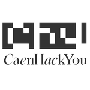

<h1 align="center">Karlblock</h1>

  <strong>DÉFENSE • FORMATION • AGENTS CYBERSEC</strong> 
  Passionné par la cybersécurité défensive, la formation et la protection des systèmes.

  
  
  

---

## About me

- Cybersécurité défensive & blue team
- Membre actif sur les plateformes CTF
- Co-fondateur de [CaenHackYou](https://caenhackyou.fr), association cyber à Caen

---

## Plateformes CTF

  
  
  

---

## Certifications

  

---

## Outils & Technologies

  
  
  
  
  

---

## CaenHackYou

  

  

> Association de cybersécurité basée à Caen. Événements, CTF, formations et partage de connaissances.

---

## Statistiques & Activité

  
  

---

  <em>Blue team mindset. Learn, defend, share.</em>

